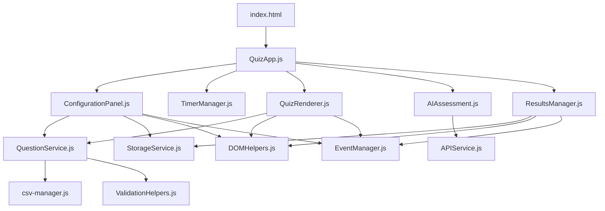

# 🏗️ Professional Quiz Application - Project Structure

## 📁 Directory Structure

```
QuizTimeHTML/
├── 📄 index.html                 # Main entry point (professional)
├── 📄 server.js                  # Express.js backend server
├── 📄 package.json               # Node.js dependencies
├── 📄 .env                       # Environment variables (OpenAI API key)
├── 📄 .env.example               # Environment template
├── 📄 README.md                  # Project documentation
├── 📄 ERROR_HANDLING_GUIDE.md    # Error handling documentation
├── 📄 .gitignore                 # Git ignore patterns
│
├── 📂 public/                    # Static HTML files
│   ├── 📄 User_Acceptance.html            # Original monolithic version
│   └── 📄 User_Acceptance_Modular.html    # Modular version
│
├── 📂 src/                       # Source code (ES6 modules)
│   ├── 📂 components/            # UI Components
│   │   ├── 📄 QuizApp.js                  # Main application orchestrator
│   │   ├── 📄 ConfigurationPanel.js      # Quiz configuration interface
│   │   ├── 📄 TimerManager.js             # Timer functionality
│   │   ├── 📄 QuizRenderer.js             # Question display & interaction
│   │   ├── 📄 AIAssessment.js             # AI integration component
│   │   └── 📄 ResultsManager.js           # Results display & analysis
│   │
│   ├── 📂 services/              # Business Logic Services
│   │   ├── 📄 QuestionService.js          # Question data management
│   │   ├── 📄 APIService.js               # Server communication
│   │   └── 📄 StorageService.js           # Local storage operations
│   │
│   ├── 📂 utils/                 # Utility Functions
│   │   ├── 📄 DOMHelpers.js               # DOM manipulation utilities
│   │   ├── 📄 EventManager.js             # Event handling system
│   │   └── 📄 ValidationHelpers.js        # Input validation utilities
│   │
│   ├── 📂 data/                  # Data Management
│   │   ├── 📄 csv-manager.js              # CSV parsing and management
│   │   └── 📄 questions.csv               # Sample question data
│   │
│   ├── 📂 style/                 # Stylesheets
│   │   └── 📄 quiz-style.css              # Main application styles
│   │
│   └── 📂 tests/                 # Test Files (future)
│       └── 📄 (test files will go here)
│
├── 📂 docs/                      # Documentation
│   ├── 📄 AI_INTEGRATION_SUMMARY.md      # AI integration documentation
│   └── 📄 PROJECT_STRUCTURE.md           # This file
│
└── 📂 node_modules/              # Node.js dependencies
    └── (generated by npm)
```

## 🎯 Key Improvements Made

### 1. **Professional Organization**
- ✅ Moved `csv-manager.js` from root to `src/data/`
- ✅ Moved `quiz-style.css` from root to `src/style/`
- ✅ Moved `questions.csv` sample data to `src/data/`
- ✅ Created `public/` folder for HTML files
- ✅ Created professional `index.html` entry point

### 2. **Modular Architecture**
- ✅ ES6 modules with proper imports/exports
- ✅ Separation of concerns (components, services, utilities)
- ✅ Clear dependency management
- ✅ Service layer for business logic

### 3. **Enhanced Entry Points**
- 🌟 **`index.html`** - Professional main entry point with enhanced error handling
- 📋 **`public/User_Acceptance_Modular.html`** - Modular component version
- 📋 **`public/User_Acceptance.html`** - Original monolithic version (preserved)

## 🚀 Entry Points Comparison

| File | Purpose | Architecture | Best For |
|------|---------|--------------|----------|
| **`index.html`** | Production-ready entry | Professional modular | Production deployment |
| **`public/User_Acceptance_Modular.html`** | Development version | Basic modular | Development/testing |
| **`public/User_Acceptance.html`** | Legacy version | Monolithic (772 lines) | Backup/reference |

## 🔧 Usage Instructions

### **For Production Use:**
```bash
# Start the server
npm start

# Open in browser
http://localhost:3000/index.html
```

### **For Development:**
```bash
# Start the server
npm run dev

# Open modular version
http://localhost:3000/public/User_Acceptance_Modular.html

# Open original version
http://localhost:3000/public/User_Acceptance.html
```

## 📋 Component Dependencies



## 🎨 Styling Architecture

- **Main Styles**: `src/style/quiz-style.css`
- **Component Styles**: Embedded in `index.html` for performance
- **Responsive Design**: Mobile-first approach
- **Professional Theme**: Modern gradient header, clean typography

## 🔒 Security & Best Practices

- ✅ Environment variables for API keys
- ✅ Input validation and sanitization
- ✅ Error boundaries for graceful failures
- ✅ Content Security Policy ready
- ✅ Modern ES6+ JavaScript standards

## 📈 Performance Features

- ✅ Lazy loading of components
- ✅ Event delegation and cleanup
- ✅ Efficient DOM manipulation
- ✅ Performance monitoring hooks
- ✅ Progressive enhancement

## 🔮 Future Enhancements

- 🎯 Service Worker for offline capabilities
- 🎯 Unit test suite with Jest
- 🎯 Build pipeline with Webpack/Vite
- 🎯 TypeScript migration
- 🎯 PWA features (manifest, icons)
- 🎯 Automated testing pipeline

## 🚀 Deployment Ready

The application is now production-ready with:
- Professional folder structure
- Clean separation of concerns
- Enhanced error handling
- Performance monitoring
- Scalable architecture

Choose your entry point based on your needs:
- **Production**: Use `index.html`
- **Development**: Use `public/User_Acceptance_Modular.html`
- **Reference**: Keep `public/User_Acceptance.html` as backup
